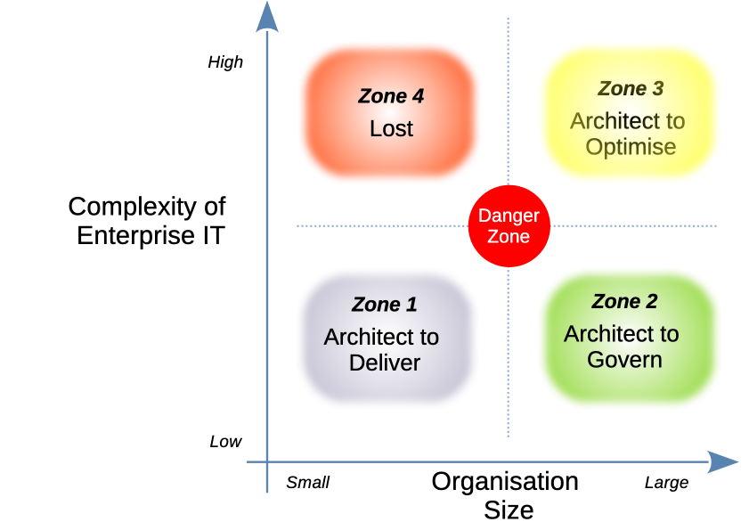

!!! question "How Effectieve is is setting Archicturral Frameworks"

    Most architectural approaches advocate the setting or Architectue Frameworks to direct and giovern the delivery of architecture. Given the potential gap between examples given at training, and the real needs of any organisation, is there a better way to establish architectural standards?
    

